## Part 1
- 1.1. Сети и маски
   - 1) Адресс сети: 192.160.0.0/13
   - 2) 
     - 255.255.255.0 | /24 | 11111111.11111111.11111111.00000000
     - /15 | 255.254.0.0/15 | 11111111.11111110.00000000.00000000
     - 11111111.11111111.11111111.11110000 | 255.255.255.240 | /28
   - 3) 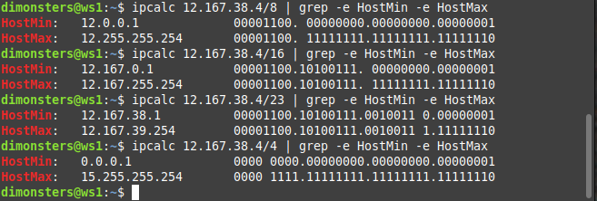
- 1.2. localhost
   - 194.34.23.100 - нет(внешний IP)
   - 127.0.0.2 - да
   - 127.1.0.1 - да
   - 128.0.0.1 - нет(Не в диапазоне 127.0.0.0/8)
- 1.3 Диапазоны и сегменты сетей
   - 1) - 10.0.0.45 - частная
        - 134.43.0.2 - публичная
        - 192.168.4.2 - частная
        - 172.20.250.4 - частная
        - 172.0.2.1 - публичная
        - 192.172.0.1 - публичная
        - 172.68.0.2 - публичная
        - 172.16.255.255 - частная
        - 10.10.10.10 - частная
        - 192.169.168.1 - публичная
   - 2) 
        - 10.0.0.1 - нет(другая подсеть)
        - 10.10.0.2 - да
        - 10.10.10.10 - да
        - 10.10.100.1 - нет(не в диапазоне)
        - 10.10.1.255 - да
## Part 2
- Клонируем виртуальную машину и в настройках устанавливаем для обеих машин внутреннюю сеть.
  Вывод *ip a*:
  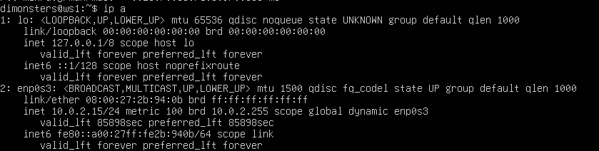

- Задаем машинам следующие адреса и маски: ws1 — 192.168.100.10, маска /16, ws2 — 172.24.116.8, маска /12.

  .yml файл для каждой машины:
  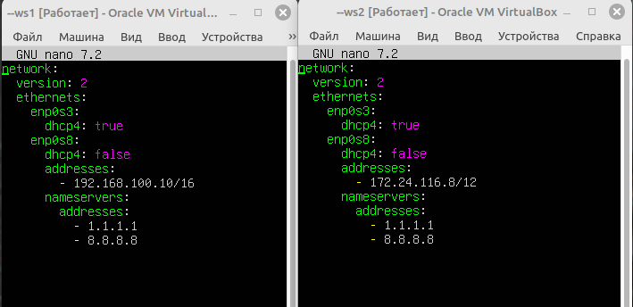

- Выполняем *sudo netplan apply* для перезапуска сервиса сети:
  

- 2.1. Добавление статического маршрута вручную
   - Для ручной настройки статического маршрута выполняем команду *ip r add [ip другой машины] dev enp0s8* и 
   пингуем для каждой машины командой *ping [ip другой машины]*:

   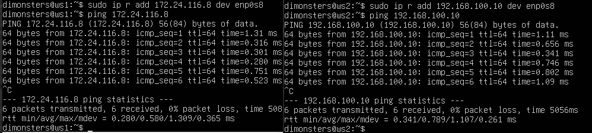
- 2.2. Добавление статического маршрута с сохранением
   - Добавляем статический маршрут от одной машины до другой с помощью .yml файлов:

   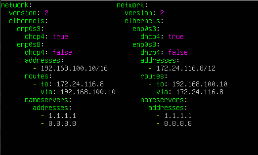
   - Повторное применение настроек и проверка ping:
   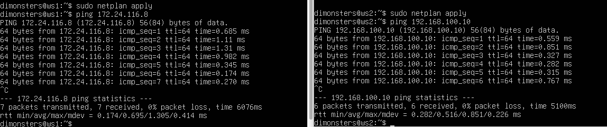
## Part 3
- 3.1. Скорость соединения
   - 8Mbps = 1MB/s

     100MB/s = 800000 Kbps

     1Gbps = 1000 Mbps
- 3.2. Утилита iperf3
   - Для того чтобы измерить скорость соединения между ws1 и ws2 одну из них мы делаем сервером командой *iperf3 -s*(ws1)
   для ws2 измеряем скорость командой *sudo iperf3 -c 192.168.100.10*
   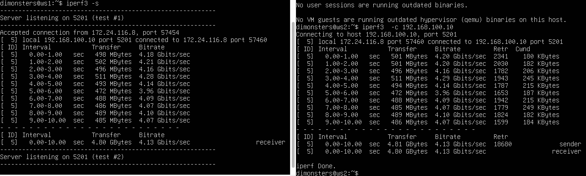
## Part 4
- 4.1. Утилита iptables
   - Создаем файл /etc/firewall.sh, имитирующий файрвол, на ws1 и ws2:
     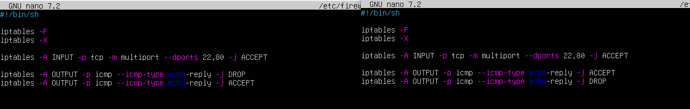
   - Запускаем файлы на обеих машинах командами *sudo chmod +x /etc/firewall.sh* и *sudo /etc/firewall.sh*:
     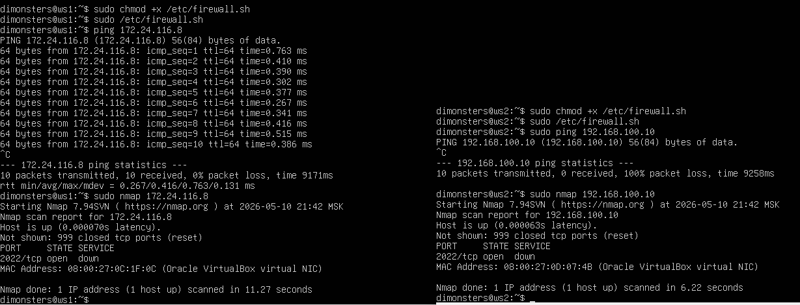
   - Разница: в ws1 мы сначала запрещаем echo-reply а потом уже разрешаем(iptables читает сверху вниз он видит заблакированно - значит нельзя пинговать), в ws2 же
     сначала разрешенно следовательно можно пинговать
- 4.2. Утилита nmap
   - 
   
   Не пингуется машина ws1, а как видно из скрина *Host is up* - значит хост поднят
## Part 5
- В настройках виртуальной машины настраиваем сеть должным образом:
   - Для r1: Adapter 1 (Internal Network, r1-ws11), Adapter 2 (Internal Network, r1-r2), Adapter 3 (NAT)
   - Для r2: Adapter 1 (Internal Network, r1-r2), Adapter 2 (Internal Network, r2-ws21-ws22), Adapter 3 (NAT)
   - Для ws11: Adapter 1 (Internal Network, r1-ws11), Adapter 2 (NAT)
   - Для ws21, ws22: Adapter 1 (Internal Network, r2-ws21-ws22), Adapter 2 (NAT)
- 5.1. Настройка адресов компьютеров
   - ws11: 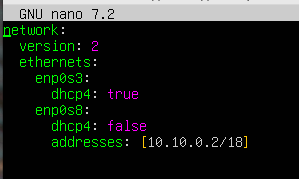
   - ws21: 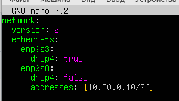
   - ws22: 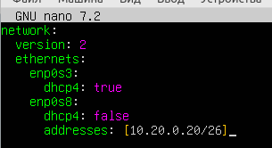
   - r1: 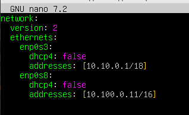
   - r2: 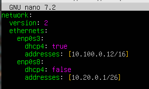
   - Перезапускаем сервис сети командой *sudo netplan apply* и командой *ip -4 a* проверяем, что адрес машины задан верно:
   - ws11: 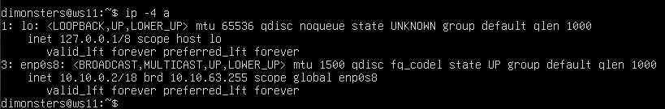
   - ws21: 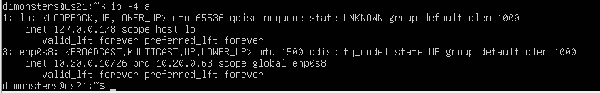
   - ws22: 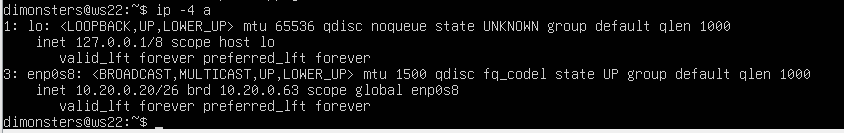
   - r1: 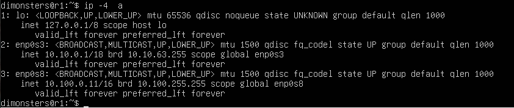
   - r2: 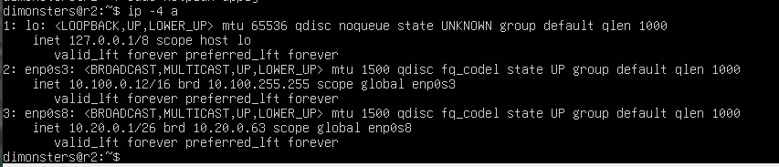
   - Ping ws22 из ws21:
   - 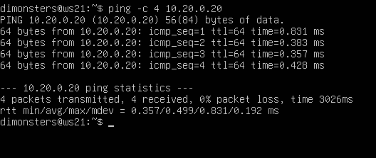
   - Ping r1 из ws11:
   - 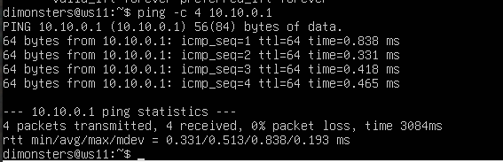
- 5.2. Включение переадресации IP-адресов
   - Включаем переадресацию IP командой *sysctl -w net.ipv4.ip_forward=1*
   - 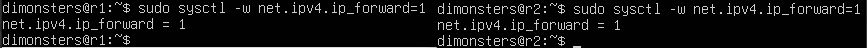
   - Открываем файл /etc/sysctl.conf и раскомментируем следующую строку: net.ipv4.ip_forward = 1
   - 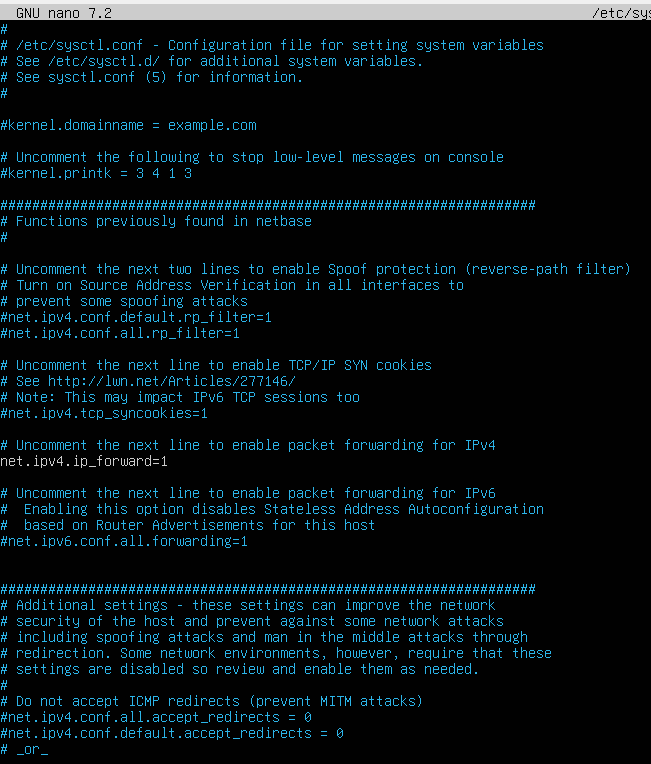
- 5.3. Конфигурация маршрута по умолчанию
   - Настраиваем маршруты в файле конфигурации
   - ws11: 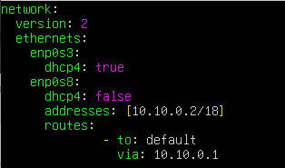
   - ws21: 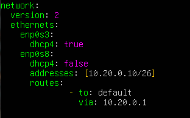
   - ws22: 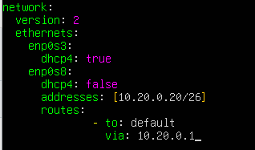
   - Перезапускаем сервис и выводим таблицу маршрутизации командой *ip r*
   - 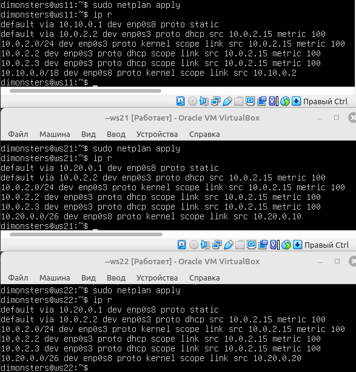
   - Пингуем с ws11 роутер r2
   - 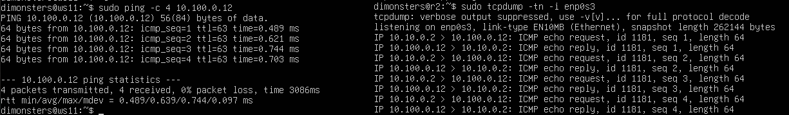
- 5.4. Добавление статических маршрутов
   - Добавляем в роутеры r1 и r2 статические маршруты в файле конфигураций
   - r1: 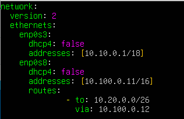
   - r2: 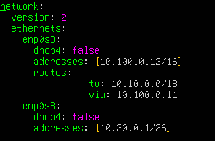
   - Вызываем *ip r* на обоих маршрутизаторах
   - 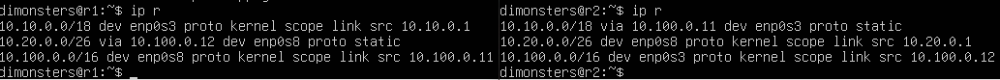
   - Вызываем *ip r list 10.10.0.0/[маска сети] и ip r list 0.0.0.0/0* на ws11
   - 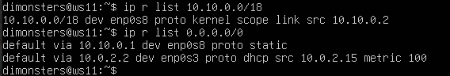
   - Адрес *0.0.0.0/0* - это "любой адрес", поэтому, команда *ip r list 0.0.0.0/0* выведет все маршруты, доступные на этом устройстве.
   - Результат команды *ip r list 10.10.0.0/18* будет отличаться, т.к этот адрес уже есть в сети устройства, и нет необходимости обращаться к маршрутизатору для дальнейшей передачи пакета.
- 5.5. Построение списка маршрутизаторов
   - Запускаем команду дампа *tcpdump -tnv -i enp0s3* на r1
   - 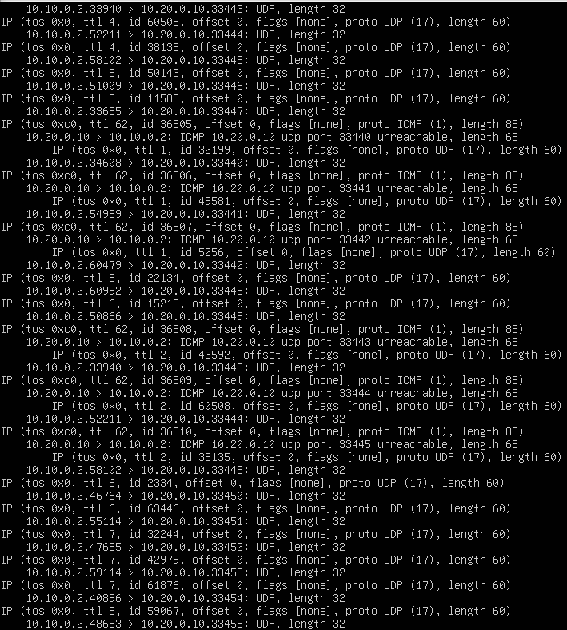
   - Используем утилиту traceroute для составления списка маршрутизаторов по пути ws11 -> ws21, команда *sudo traceroute 10.20.0.10*
   - 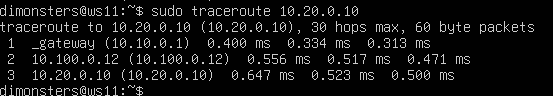
   - Traceroute использует механизм истечения срока жизни пакета, чтобы заставить каждый промежуточный роутер «представиться», отправив сообщение об ошибке обратно отправителю.
- 5.6. Использование протокола ICMP при маршрутизации
   - Запускаем на r1 перехват сетевого трафика, проходящего через enp0s3 с помощью команды *sudo tcpdump -n -i enp0s3 icmp*
   - 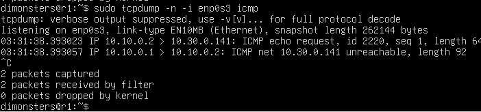
   - Пингуйем с ws11 несуществующий IP 10.30.0.141 с помощью команды *ping -c 1 10.30.0.141*
   - 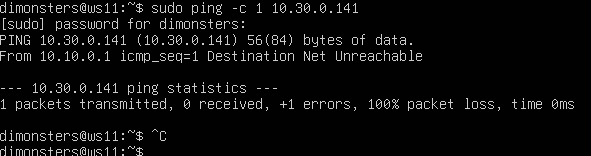
## Part 6
- Для r2 настраиваем конфигурацию службы DHCP в файле /etc/dhcp/dhcpd.conf и в файле resolv.conf пропиши nameserver 8.8.8.8
- 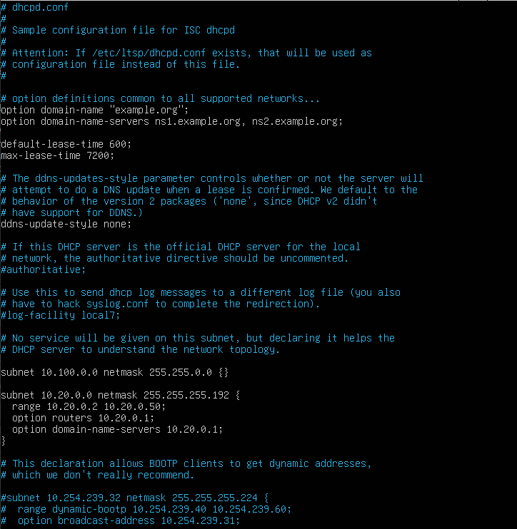
- 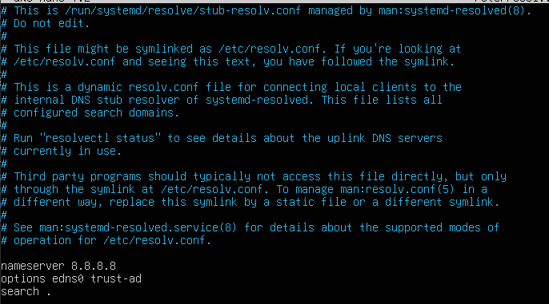
- Перезагружаем службу DHCP командой *systemctl restart isc-dhcp-server*. Машину ws21 перезагружаем при помощи *reboot* и через и видим, что она получила адрес. 
- 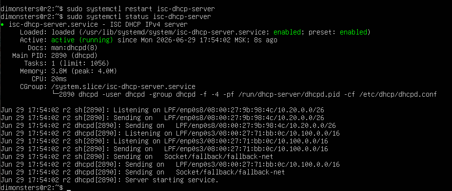
- 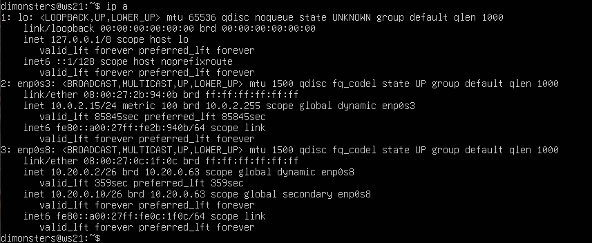
- Также пингуем ws22 с ws21
- 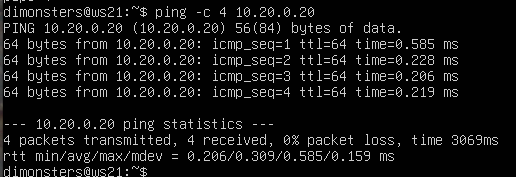
- Настраиваем MAC-адрес ws11 в настройках виртуальной машины и в netplan
- 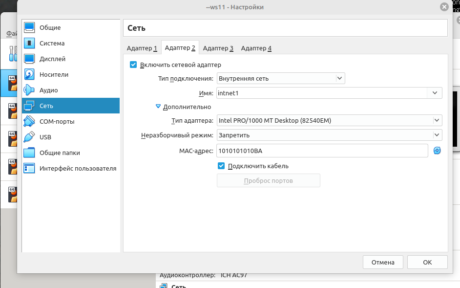
- 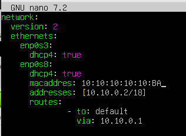
- Настраиваем r1 так же, как r2, но с назначением адресов строго привязанным к MAC-адресу ws11
- 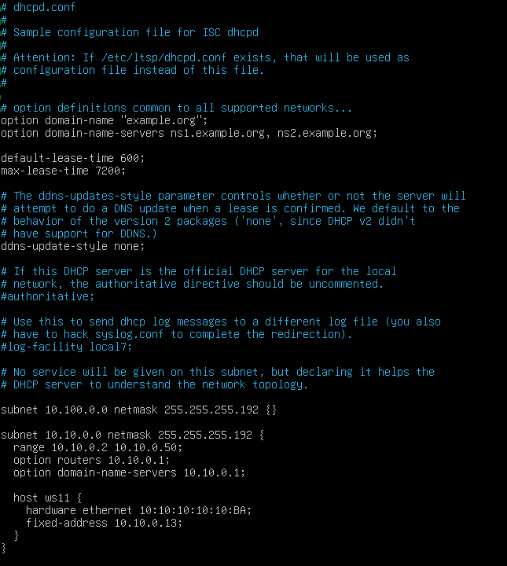
- 
- 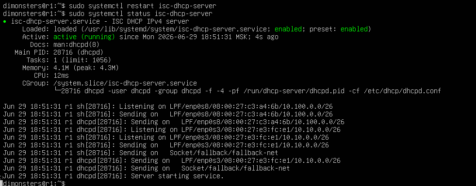
- Новый IP-адрес ws11
- 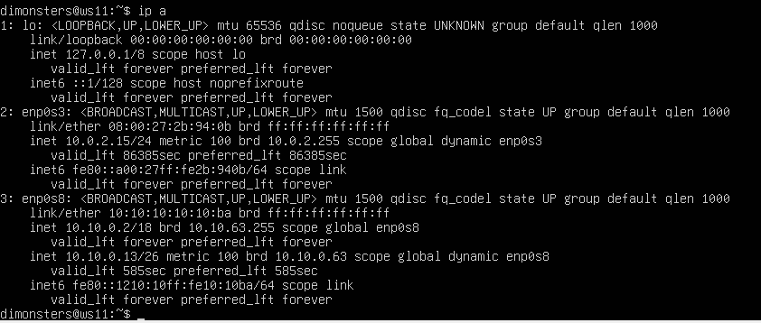
- Запрашиваем с ws21 обновление IP-адреса
- Старый адресс: 
- Новый адресс: 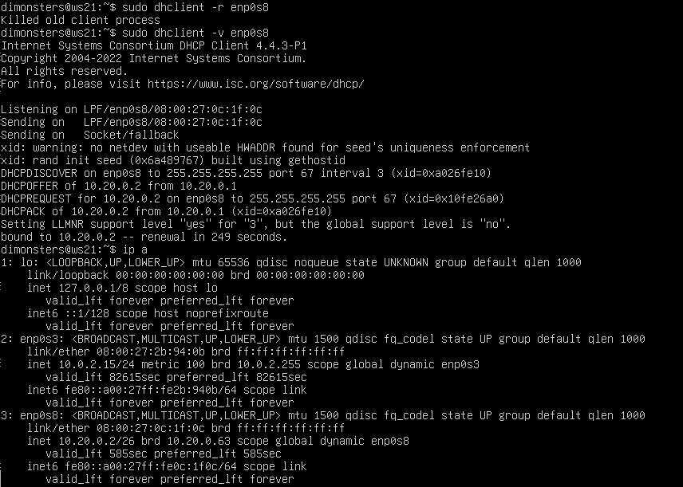
- 
## Part 7
- В файле /etc/apache2/ports.conf на ws22 и r1 меняем строку Listen 80 на Listen 0.0.0.0:80
- 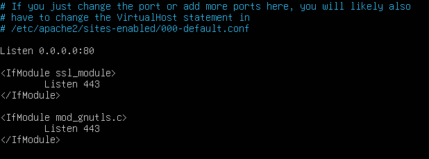
- Запускаем веб-сервер Apache командой *service apache2 start* на ws22 и r1
- 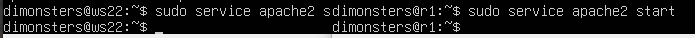
- Создаем фаервол с правилами из задания и запускаем его
- 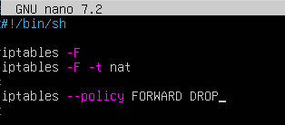
- 
- Проверяем соединение между ws22 и r1
- 
- Добавляем в файл еще одно правило и запускаем фаервол
- 
- 
- Снова проверяем соединение между ws22 и r1
- 
- Добавляем в файл ещё два правила и запускаем фаервол вновь
- 
- Проверяем соединение по TCP для SNAT
- 
- Проверь соединение по TCP для DNAT
- 
